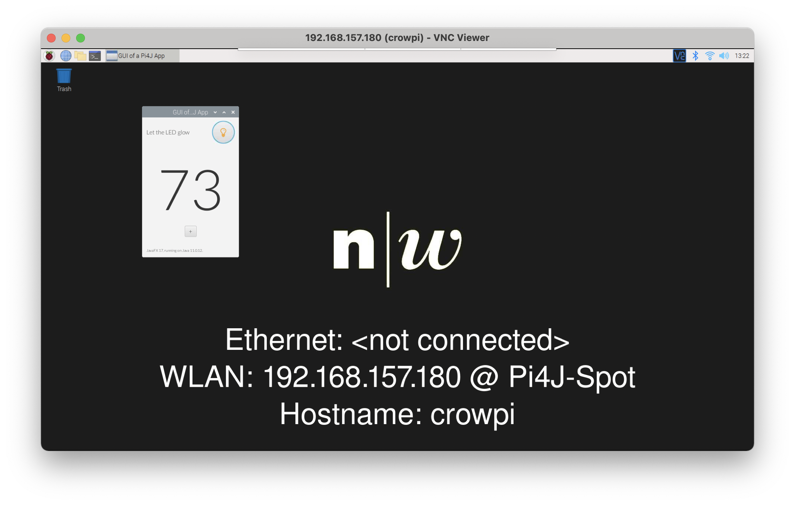
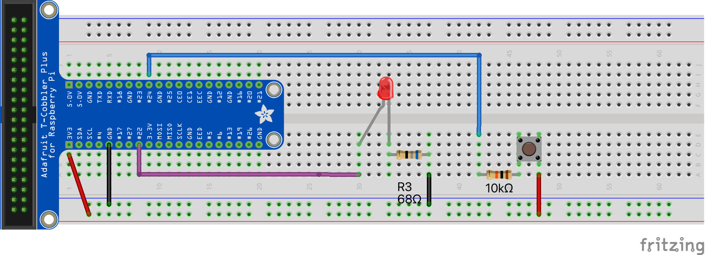
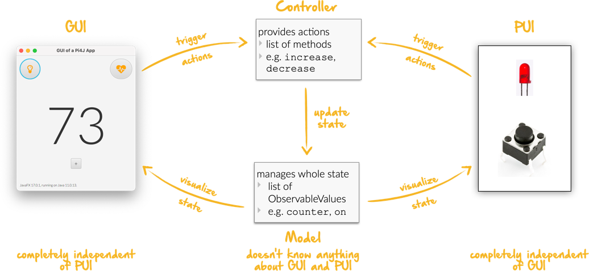
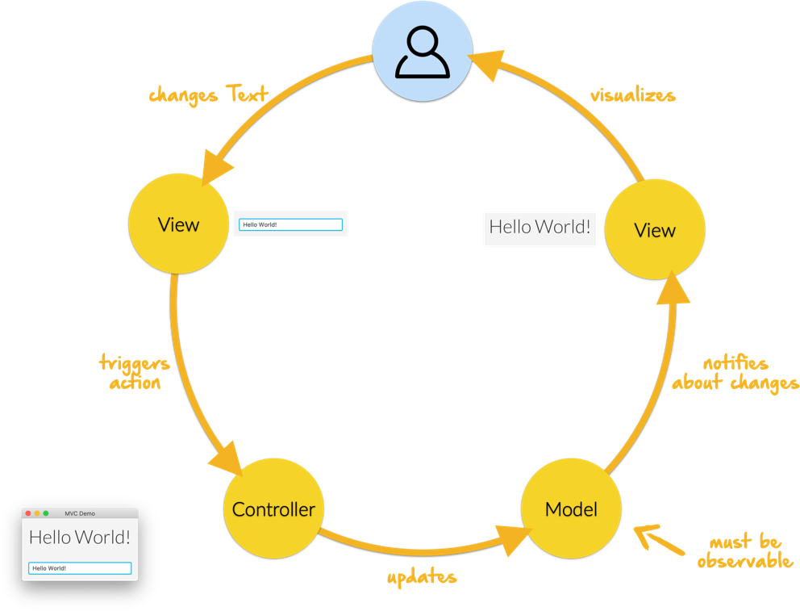

[Deutsche Beschreibung ist hier.](README_DE.md)

# Pi4J Applications with JavaFX based GUI

[](https://github.com/Pi4J/pi4j-template-javafx/graphs/contributors)
[](https://github.com/Pi4J/pi4j-template-javafx/blob/master/LICENSE)

## Create a repository

This repository should not be cloned directly. This is a template project and one should create their own project by using the `Use this template` Button.

## Prepare Raspberry Pi

Use the Pi4J-Basic-OS image from [Pi4J-Team](https://github.com/Pi4J/pi4j-os)

- Download [Pi4J-Basic-OS](https://pi4j-download.com/latest.php?flavor=basic) Image.
- Extract the ZIP file.
- Use  [Raspberry Pi Imager](https://www.raspberrypi.org/blog/raspberry-pi-imager-imaging-utility/). 
  - Specify a new user `pi` with password `pi4j` in preferences of  `Imager`. 
  - Write the image to an SD-Card.
- Start the Raspberry Pi with this SD-Card.

The Pi4J-Basic-OS image contains all the necessary packages and software for JavaFX/Pi4j applications.

## Preparing a developer computer

* [Java 17](https://adoptium.net/?variant=openjdk17&jvmVariant=hotspot). The Pi4J-Basic-OS image uses JDK17, thus the developer computer should use the same. 
  * Note for Linux and Mac users: The usage of SDKMAN is recommended for the management of JDKs.
* [IntelliJ IDEA](https://www.jetbrains.com/idea/download/)
  * Using the latest version is important. 
  * Installing via [JetBrains Toolbox](https://www.jetbrains.com/toolbox-app/) is recommended. The Ultimate Edition is also recommended.
* [Git](https://git-scm.com/downloads). The source code repository is a git repository
* `ssh`. The connection to the Raspberry Pi is done using `ssh`. Most computers have SSH preinstalled.
* [VNC Viewer](https://www.realvnc.com/en/connect/download/viewer/). A VNC Viewer allows for comfortable access to the Raspberry Pi's desktop, without the need of physically connecting monitor, keyboard and mouse to the Raspberry Pi.

## Recommendation for installing the JDK on Linux and MacOS

[SDKMAN](https://sdkman.io) is an ideal tool for managing JDK versions and other development tools on Linux and MacOS.

#### Installing SDKMAN

Enter the following command in a terminal:

```shell
export SDKMAN_DIR="$HOME/sdkman" && curl -s "https://get.sdkman.io" | bash
```

If SDKMAN has already been installed, it can be updated with the following command:

```shell
sdk update
```

Note: After installing it might be necessary to close and open the terminal for the SDKMAN command `sdk` to be accessible.

#### Installation of the JDK

In a new terminal window, enter the following command:

```shell
sdk install java 17.0.9-tem
```

This installs the JDK in your home directory `sdkman/candidates/java`. It can then be used from this directory in IntelliJ.

The following command lists which JDKs are available for installation:

```shell
sdk ls java
```

## Validate Java Version

Enter the following command in a new terminal:

```shell
java -version
```

The resulting output should be similar to the following:

```shell
openjdk version "17.0.9" 2023-10-17
OpenJDK Runtime Environment Temurin-17.0.9+9 (build 17.0.9+9)
OpenJDK 64-Bit Server VM Temurin-17.0.9+9 (build 17.0.9+9, mixed mode)
```

Should JDK 17.x not be the default, then it can be changed with the following command:

```shell
sdk default java 17.0.9-tem
```

## Connect to the Raspberry Pi

The developer computer and the Raspberry Pi must be on the same WLAN.

A simple solution for this is to create a hotspot with a smartphone. For instance with these parameters:

* SSID: `Pi4J-Spot`
* Password: `MayTheSourceBeWithYou!`

The Pi4J-Basis-OS image is configured to automatically connect to this hotspot and shows its IP address in the background image.

Connect your developer PC also to the hotspot `Pi4J-Spot`.

#### Connecting via SSH

Enter the following in a terminal of the developer computer:

```shell
ssh pi@<ip.number>
Passwort: 'pi4j'
```

e.g.:

```shell
ssh pi@192.168.183.86
Passwort: 'pi4j'
```

If your Raspberry Pi is the only one connected to your hotspot, you can use `pi4j.local` instead of the ip-number.

```shell
ssh pi@pi4j.local
Passwort: 'pi4j'
```

#### Connecting via VNC

Using the same IP address (or `pi4j.local`) a VNC connection to the Raspberry Pi can be made. The VNC client shows a window which gives access to the entire desktop of the Raspberry Pi.

The following shows an example session with the started ExampleApp:



## Build System

This project uses Apache Maven for building the projects. Building can be done either locally on your developer computer or on the Raspberry Pi.

During a local build, the resulting artifacts are copied to the Raspberry Pi and then started there. Development *can* be done on the Raspberry Pi, but is not recommended. It is far more comfortable to do development on your local development computer and then run the application on the Raspberry Pi.

To build locally and run on the Raspberry Pi, a few configuration changes are needed.

#### Configuration in `pom.xml`

- `launcher.class`: defines which application to start. The `pom.xml` already contains a lists of candidates, simply uncomment the desired application, commenting out the rest.
- `pi.hostname`: The hostname of the Raspberry Pi, e.g. `pi4j`. Is shown on RaspPi's monitor. 
- `pi.ipnumber`: The current IP of the Raspberry Pi, e.g. `192.168.1.2`, is used for SCP/SSH. Also shown on the monitor.

Using this setup the application can be started through a Maven command on the Raspberry Pi. A more comfortable method is using IntelliJ run configurations.

#### Configuration of the IntelliJ run configurations

Four run configurations are already predefined. Two for starting the project, either locally or remote, and two for debugging the application on the Raspberry Pi.

- `Run Local` starts the program defined in `launcher.class` on the developer computer. This is used especially for GUI development, thus without access to the sensors and actuators attached to the Raspberry Pi.
- `Run on Pi` starts the program on the Raspberry Pi.
- `Debug on Pi` starts the program on the Raspberry Pi im debug mode.
- `Attach to Pi Debugger` connects IntelliJ on the developer computer with the application already running through `Debug on Pi`.

## The example applications

#### HelloFX

Used only to test if the JavaFX libraries are installed correctly. Should not be used as a template for one's own JavaFX applications.

To start:

- Set `launcher.class` in `pom.xml`:
  - `<launcher.class>com.pi4j.mvc/com.pi4j.setup.HelloFX</launcher.class>`
- With `Run local` starts locally on the developer computer
- With `Run on Pi` starts remotely on the Raspberry Pi

Once the JavaFX setup has been tested, HelloFX can be deleted.

#### Wiring

The other example applications use a LED and a button. These must be wired as is shown in the following diagram:



#### MinimalPi4J

The MinimalPi4j application is a Pi4J only application without a GUI. This application is also only used to test the setup and can be deleted after testing.

To start:

- Set `launcher.class` in `pom.xml`:
  - `<launcher.class>com.pi4j.mvc/com.pi4j.setup.MinimalPi4J</launcher.class> `
- `Run local` does not make sense for this example, as no LEDs or buttons are connected to the local development computer.
- With `Run on Pi` starts remotely on the Raspberry Pi

Pressing the button should generate a message in the console.


#### TemplateApp

This application shows the interaction between a JavaFX based Graphical User Interface (GUI) and the Raspberry Pi connected sensors and actuators, the Physical User Interface (PUI).

This application is to be used as a template for one's own applications. This includes the existing test cases.

You should first get to know and understand the example. For your own applications you should then copy the TemplateApp and modify it for your project, however without violating the rules of the MVC concept, which is described below.

To start:

- Set `launcher.class` in `pom.xml`:
  - `<launcher.class>com.pi4j.mvc/com.pi4j.mvc.templateapp.AppStarter</launcher.class>`
- With `Run local` (or directly from the IDE) starts locally on the development computer. Useful for the GUI development. The PUI is not available on the local computer. The GUI can largely be developed without the need for a Raspberry Pi.
  - in `AppStarter` a simple `PuiEmulator` can be started, so that the interaction between GUI and PUI can also be tested on the local development computer.
- With `Run on Pi` starts remotely on the Raspberry Pi (now including the PUI)

#### TemplatePUIApp

The MVC concept should also be used for applications without a GUI.

When developing PUI only applications, or when adding the GUI later, then one should use the `TemplatePUIApp` as template.

To start:

- Set `launcher.class` in `pom.xml`:
  - `<launcher.class>com.pi4j.mvc/com.pi4j.mvc.templatepuiapp.AppStarter</launcher.class>`
- `Run local` makes no sense for PUI only applications
- With `Run on Pi` starts remotely on the Raspberry Pi

## Start application in debugger

To start the application on the Raspberry Pi in debug mode the two run configurations `Debug on Pi` and `Attach to Pi Debugger` are required.

The sequence of starting the run configurations is critical:

1. Start `Debug on Pi` using the **Run** button
2. Wait till the console contains the following message: `Listening for transport dt_socket at address: 5005 (Attach debugger)`
3. Start `Attach to Pi Debugger` using the **Debug** button
4. Only now will the GUI be shown on the Raspberry Pi screen

Now one can use the debugger from IntelliJ IDEA, setting breakpoints and stepping through the application.

## The MVC concept

The classic Model-View-Controller concept contains in addition to the starter class at least 3 more classes. The interaction is clearly defined:



- _Model classes_

  - contain the complete state which is to be visualized, thus these classes are called _Presentation-Model_
  - are completely separate to the Controller and View classes, i.e. they may not interact with those classes
- _Controller classes_

  - define the entire functionality, i.e. the so-called actions, in the form of methods
  - manage the model classes by definition of the business logic
  - have no access to the view classes
- _View classes_

  - only calls methods on the controller, i.e. triggering actions
  - are notified of the model of state changes
    - observes the state of the model
  - never change the model directly
- _Starter class._

  - Is a subclass of `javafx.application.Application`. Instantiates the three other classes and starts the application.

In our case at least two view classes exist:

- _GUI class._ The Graphical-User-Interface. JavaFX based implementation of the visualisation of the UI on the screen.
- _PUI class._ The Physical-User-Interface. Pi4J based implementation of the sensors and actors. Uses `Component` classes, as is used in [Pi4J Example Components](https://github.com/Pi4J/pi4j-example-components.git).

GUI and PUI are completely separated from each other, i.e a GUI button to turn an LED on has no direct access to the LED component of the PUI. Instead the GUI button triggers a corresponding action in the controller which then sets the `on` state property in the model. The PUI listening on this state then turns the actual LED on or off.

GUI and PUI work with the same identical controller and thus also the same identical model.

It is important that one understands this concept and then apply the concepts to one's own project. Should you have questions, contact the Pi4j team.

In the MVC concept, every user interaction traverses the exact same cycle:



#### Projector Pattern

The view classes, i.e. GUI and PUI, implement the Projector-Pattern published by Prof. Dierk König  [Projector Pattern](https://dierk.github.io/Home/projectorPattern/ProjectorPattern.html).

The basic tasks of the GUI and PUI are the same. When looking at the code, this is visible:
they implement the common interface `Projector` and can thus be used in the same way.

Consequences of this design:

- Additional UIs can be added, without having to change existing classes, except for the starter class
  - An example for this is the `PuiEmulator`, which can be started when necessary.
- This architecture is also useful for
  - GUI only applications and
  - PUI only applications (see `TemplatePUIApp`).

### Implementing the MVC concept

The base classes, required by the MVC concept, are in the package `com.pi4j.mvc.util.mvcbase`. The classes have extensive documentation.

## MultiControllerApp

An more advanced example is the `MultiControllerApp`. It shows the usage and relevancy of multiple controllers in an application.

For any controller the following is imperative:

- each action is asynchronous and follows the sequence of actions explicitly
- for this each controller uses its own `ConcurrentTaskQueue`
- the UI is thus never blocked by an action
- if a UI triggers additional actions when an action is in execution, there this action is stored in the `ConcurrentTaskQueue` and executed after the current action has completed.

For simple applications, a single controller will suffice.

There are situations where actions are to be executed in parallel.

The `MultiControllerApp` shows such an example. It should be possible to change the counter, _while an LED is blinking_.

- With a single controller this would not be accomplishable. The controller would execute the `Decrease-Action` only after the `Blink-Action` is complete.
- With two controllers this is simple: `LedController` and `CounterController` each have a `ConcurrentTaskQueue`. Actions which concern the LED are thus executed independent of actions which modify the counter.
- An `ApplicationController` is implemented to coordinate the other controllers, thus giving the UI only a singly visible API.

To start:

- Set `launcher.class` in `pom.xml`:
  - `<launcher.class>com.pi4j.mvc/com.pi4j.mvc.multicontrollerapp.AppStarter</launcher.class>`
- With `Run local` (or directly from the IDE) starts locally on the development computer
  - A rudimentary `PuiEmulator` can be started in `AppStarter`, to test the interaction of the GUI and PUI.
- With `Run on Pi` starts remotely on the Raspberry Pi

## JUnit Tests

Through the clear separation in model, view and controller, testing of large parts of the application can be automated. These tests are usually executed on the local development computer, i.e. not on the Raspberry Pi.

#### Controller Tests

The controller implements the entirety of the base functionality. It should be validated with extensive test cases.

It should be pointed out, that all changes to the model are performed asynchronously, thus validation can only be done after the asynchronous Tasks are completed.

An example can be seen in `SomeControllerTest`.

#### Presentation-Model Tests

The model is simply a collection of `ObservableValues` and doesn't offer any additional functionality, thus it does not require any additional test cases.

#### Tests for individual PUI-Components

The individual PUI-components can be tested easily using the Pi4J integrated `MockPlatform`. These tests can be executed locally on the development computer. A Raspberry Pi is not needed.

Examples for such component tests can be seen in the [CrowPi-Tutorial](https://github.com/Pi4J/pi4j-example-crowpi/tree/main/src/test/java/com/pi4j/crowpi/components) and in the package `com.pi4j.mvc.templateapp.view.pui.components`.

#### PUI Tests

The PUI can also be tested quite well with JUnit tests.

It should be pointed out, that the actions are again executed asynchronously.

An example is the `SomePUITest`.

## LICENSE

This repository is licensed under the Apache License, Version 2.0 (the "License"); you may not use this file except in compliance with the
License. You may obtain a copy of the License at: http://www.apache.org/licenses/LICENSE-2.0

Unless required by applicable law or agreed to in writing, software distributed under the License is distributed on an "AS IS" BASIS,
WITHOUT WARRANTIES OR CONDITIONS OF ANY KIND, either express or implied. See the License for the specific language governing permissions and
limitations under the License.
