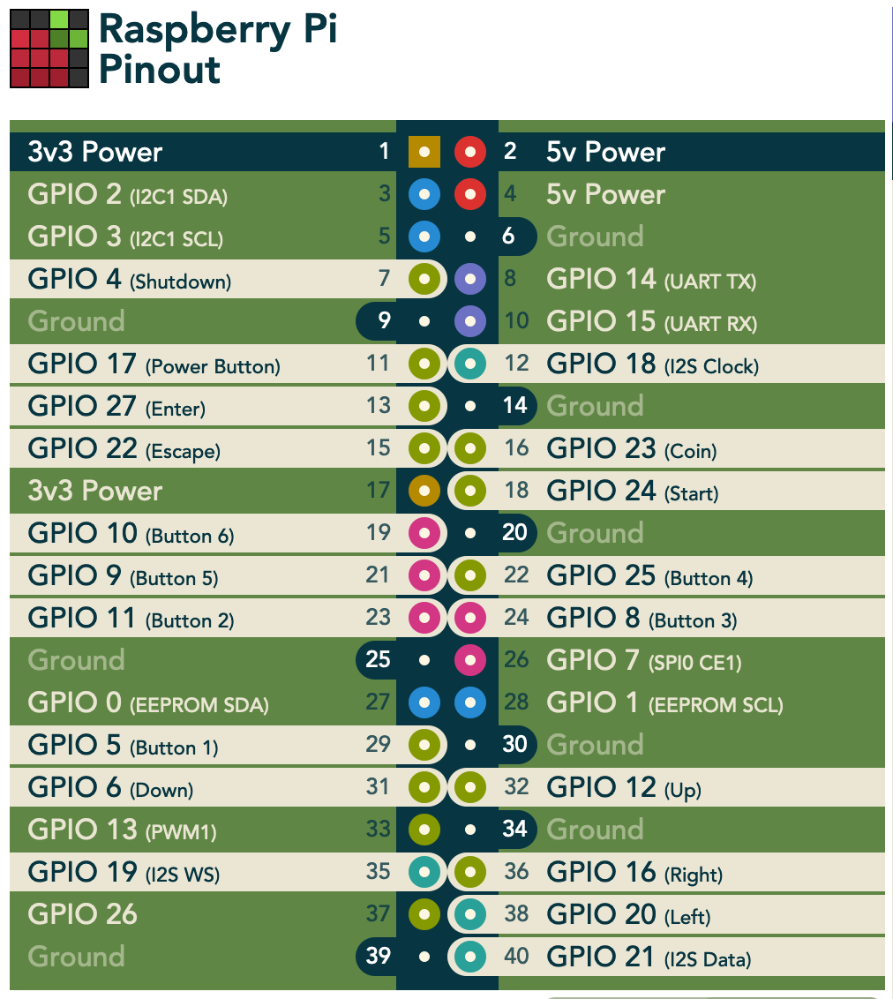

# WS2C - FXGL Games on Picade Console

## Team

* hier die Namen der Teammitglieder eintragen

## Voraussetzungen

Auf dem Entwickler-Laptop

* [Java 11](https://adoptopenjdk.net). Auf dem Raspberry Pi wird die Verwendung von JDK 11 empfohlen. Daher verwenden wir diesen auch auf dem Laptop. Hinweis für Mac-Benuter: Die Verwendung von sdkman (s.u.) für die Installation und die Verwaltung von JDKs ist sehr empfehlenswert.

* [IntelliJ IDEA 2021.2](https://www.jetbrains.com/idea/download/). Es ist wichtig, diese neueste Version zu verwenden. Am besten via [JetBrains Toolbox](https://www.jetbrains.com/toolbox-app/) installieren. Empfehlenswert ist die Verwendung der Ultimate Edition. Studierende erhalten, nach Anmeldung, eine kostenlose Lizenz. Registrieren Sie sich unter [https://www.jetbrains.com/student/](https://www.jetbrains.com/student/) mit Ihrer FHNW E-Mail-Adresse. Für die Community-Edition benötigt man keine Lizenz.

* [Git](https://git-scm.com/downloads). Als Sourcecode-Repository verwenden wir git. 

* [GitHub-Account](https://github.com). Wir werden mit GitHub Classroom arbeiten. Dafür benötigen Sie einen GitHub Account. 

* `ssh`. Die Verbindung zum Raspberry Pi wird mit `ssh` hergestellt. Ist normalerweise auf allen Laptops vorinstalliert.

## Empfehlung zur Installation des JDK für MAC (UND LINUX)

Für Mac und Linux gibt es ein sehr empfehlenswertes Tool zur Verwaltung unterschiedlicher Software Development Kits: [SDKMAN](https://sdkman.io)

Insbesondere wenn, wie üblich, mehrere Java JDKs verwendet werden sollen, hilft SDKMAN.

Sie können natürlich auch weiterhin die "normalen" Installationsmöglichkeiten verwenden.

### Installation von SDKMAN:
Folgenden Befehl in einem Terminal eingeben:

`export SDKMAN_DIR="$HOME/sdkman" && curl -s "https://get.sdkman.io" | bash`

Falls Sie SDKMAN bereits früher installiert haben, müssen Sie SDKMAN auf den neuesten Stand bringen:

`sdk update`

### Installation von JDK 11 
In einem neuen Terminal-Window diesen Befehl eingeben:

`sdk install java 11.0.11.hs-adpt`

Danach liegt der JDK in ihrer Home-Directory im Folder `sdkman/candidates/java`. Von dort können Sie es dann in IntelliJ als neuen SDK anlegen und im Projekt verwenden.

Mit: 

`sdk ls java`

können Sie sich auflisten lassen welche anderen JDKs zu Installation zur Verfügung stehen.

## Verbindung zum Raspberry Pi herstellen
Der Laptop und der Raspberry Pi müssen das gleiche WLAN verwenden.

Eine einfache Variante dies sicherzustellen ist das Aufsetzen eines Hotspots auf einem Smartphone.

- ssid: `Pi4J-Spot`
- password: `MayTheCodeBeWithYou!`

Auf diesen Hotspot connected sich der RaspPi automatisch und zeigt die IP-Nummer im Hintergrundbild an.

Den Laptop ebenfalls mit dem Pi4J-Spot verbinden.

In einem Terminal-Window des Laptops:

`ssh pi@<ip.number>`

z.B.
`ssh pi@192.168.183.86`
 
Passwort: `crowpi`

## Build System

Dieses Projekt verwendet Maven, um die verschiedenen Applikationen zu bauen und entweder lokal auf dem Laptop oder auf der Picade Console auszuführen.

Die Artefakte werden dabei auf dem Laptop gebaut, anschliessend auf den Raspberry Pi kopiert und dort gestartet.

Dazu müssen nur wenige Konfigurationen verändert werden.

### Einstellungen im `pom.xml`

- **`launcher.class` (required):** gibt an, welche Applikation gestartet werden soll. Im `pom.xml` ist bereits eine Liste von Kandidaten enthalten. Man muss nur bei der jeweils gewünschte Applikation die Kommentare entfernen.
- **`pi.ipnumber` (optional):** Die aktuelle IP-Nummer des Raspberry Pi, z.B. `192.168.1.2`, wird für SCP/SSH benötigt. 

Mit diesen Einstellungen kann die Applikation mittels Maven-Befehl auf dem Raspberry Pi gestartet werden. Besser ist es jedoch, die Run-Configurationen von IntelliJ zu verwenden.

### Einstellungen in den Run-Konfigurationen

Im Projekt sind 3 Run-Konfigurationen vordefiniert
- `Run Local` startet das Programm, das in `launcher.class` eingestellt wurde, auf dem Laptop. Wird vor allem während der Game-Entwicklung gebraucht.
- `Run DRM` startet das Programm auf dem Raspberry Pi im Direct-Rendering-Mode. Wird gebraucht sobald das Programm ein GUI enthält (sowohl reine JavaFX-Programme als auch FXGL Games).
- `Run X11` startet das Programm auf dem Rasberry Pi im "Normal-Modus". Wird für Programme verwendet, die reine Pi4J-Applikationen sind und kein GUI enthalten.

In `Run DRM`und `Run X11` muss jeweils diese IP-Adresse eingestellt werden. Dazu  `Edit Configurations` wählen. 

Im nun geöffnenten Dialog den Tab `Runner` öffnen und `pi.ipnumber` doppelklicken. Danach öffnet sich das Dialogfenster zur Eingabe der IP-Adresse. 

## Pin Nummern der Picade Console

## LICENSE

This repository is licensed under the Apache License, Version 2.0 (the "License"); you may not use this file except in compliance with the
License. You may obtain a copy of the License at: http://www.apache.org/licenses/LICENSE-2.0

Unless required by applicable law or agreed to in writing, software distributed under the License is distributed on an "AS IS" BASIS,
WITHOUT WARRANTIES OR CONDITIONS OF ANY KIND, either express or implied. See the License for the specific language governing permissions and
limitations under the License.

