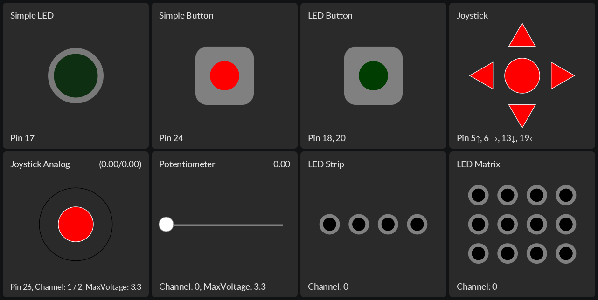
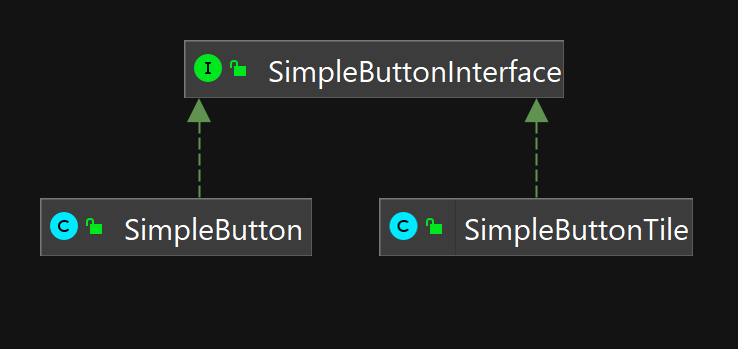
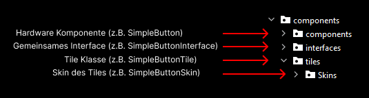
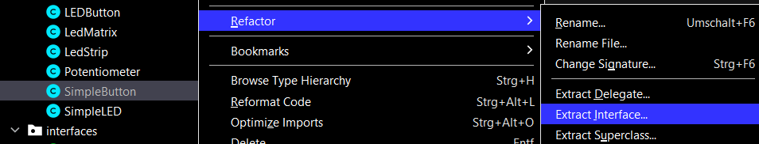

# Tiles

Ein Tile dient als eine graphische Darstellung der Sensoren und Aktuatoren (PUI), welches am Raspberry Pi angeschlossen wird. Die Tiles werden zusammen als Dashboard nebeneinander platziert und stellt das Graphical-User-Interfaces (GUI) der Applikation dar. Das GUI und das PUI verwenden das MVC in einer identischen Weise, welches die Implementation beider Klassen vereinfacht. Das GUI sollte die Funktionen der PUI simulieren und es möglich machen, den eigenen Code auch ohne Raspberry Pi testen zu können.

Das GUI könnte beispielsweise so aussehen:

## TilesFX

Der Name «Tile» stammt von der JavaFX Library «TilesFX», auf welches die graphische Komponente aufgebaut sind. Die Library ist bereits importiert, welches man im pom.xml und External Libraries sehen kann. Mehr Informationen und der aktuelle Stand der TilesFX Library kann man bei der GitHub Repository ersehen: [https://github.com/HanSolo/tilesfx/tree/jdk17](https://github.com/HanSolo/tilesfx/tree/jdk17)

## Aufbau

Ein Tile ist auf zwei Klassen aufgebaut, einer Skin-Klasse und einer Tile-Klasse. Die Skin-Klasse ist die Oberfläche eines Tiles und ist rein für die Gestaltung da. Die Tile-Klasse umfasst die Interaktivität des Tiles, bzgl. Mouse Click oder Drag Funktionen. Die Tile-Klasse implementiert das gleichnamige Interface und verwendet die gleichen Methoden wie die gleichnamige Hardware-Komponente Klasse.

## Integrieren der Komponente (GUI & PUI)

_Die Integration der Tiles zur Komponenten Katalog hat noch nicht stattgefunden. Geplant ist, dass die Tiles mit den Skins im Katalog vorhanden werden soll._

Vom Komponenten Katalog [Repository](https://github.com/Pi4J/pi4j-example-components) nimmt man die gewünschte Komponente, das gleichnamige Interface, das Tile mit dem Skin und platziert die in den entsprechenden Directories des Projekts.

Das Interface wird am Anfang der Klasse als Variabel hinzugefügt. Die Variabel wird im **initializeParts()** bei der SomeGUI & SomePUI Klassen initialisiert. Bei der SomeGUI Klasse wird eine neue Tile-Klasse und bei SomePUI wird eine neue Komponente-Klasse initialisiert.

Zusätzlich muss das Tile beim SomeGUI in der **layoutParts()** Methode mit einem Cast des Typs: **Tile**, hinzugefügt werden.

In der **setupUiToActionBindings()** Methode wird auf eine Interaktion mit dem GUI oder PUI reagiert und eine Methode wird dem Controller zur Ausführung übergeben.

In der **setupModelToUiBindings()** Methode wird auf eine Veränderung von einem ObservableValue der **SomeModel** gelauscht. Bei einer Veränderung reagiert das GUI und PUI gemäss definierter Änderung.

## Neues Tile erstellen

Im Komponenten Katalog [Repository](https://github.com/Pi4J/pi4j-example-components) befinden Hardware-Komponente Klasse ohne einer Tile Implementation.

Für einen funktionalen Tile braucht es 3 Klassen:

- Skin-Klasse
- Interface
- Tile

Für die Gestaltung sollte man sich bei den vorhandenen Skins in der Komponenten Katalog oder der TilesFX Repository inspirieren lassen. Es ist zu empfehlen, ein schlichter Prototyp zu erstellen zur besseren Orientierung und Visualisierung des Tiles. Zu beachten ist, dass das Tile die Interaktion der Hardware-Komponente simulieren soll und die GUI JavaFX als Sprache hat.

### Skin-Klasse

Falls eine vorhandene Skin-Klasse ähnliche Elemente erhält, dann sollte man diese kopieren und auf der Klasse aufbauen. Jedes Skin-Klasse erbt von der TileSkin Klasse und hat die gleiche Struktur. Vor dem Konstruktor werden als erstes die Formen und Texte definiert.

In der **initGraphics()** Methode werden die Formen und Texte neu initialisiert und gestalten. Für eine einheitliche Gestaltung können die Werte des Texts und Titletexts von den anderen Skins übernommen werden. Nachdem sie initialisiert sind, werden sie der Pane weitergegeben.

Die nächsten drei Methoden (**registerListeners(), handleEvents(), handleCurrentValue()**) können so gelassen werden. In der **resizeStaticText()** kann die Grösse und Position der Text-Elemente verändert werden.

In der **resize()** Methode wird die Grösse und Position der Formen definiert. Für besseres Resizing sind relative Werte zu empfehlen. Die **redraw()** Methode bleibt identisch.

### Interface

Nachdem die Hardware-Komponente Klasse in das Projekt hinzugefügt wird, muss die wichtigen Methoden der Klasse als Interface extrahieren. Das beinhaltet alle Methoden, welche die Komponenten-Klasse und die Tile-Klasse für eine vollständige Funktionalität brauchen. Zur Orientierung sollte man auf den Beispielcode der Hardware-Komponente schauen, welches in der [Repository](https://github.com/Pi4J/pi4j-example-components) oder der [Pi4J Webseite](https://pi4j.com/examples/components/) befindet.

Mit Intelij kann man die Methoden von der Klasse als Interface extrahieren, indem man auf die Hardware-Komponente Klasse in der Projektübersicht rechtsklickt, auf Refactor und dann Extract Interface navigiert.

Das Interface sollte, wie die anderen Interfaces, in der interfaces Directory platziert werden. Die Hardware-Komponente Klasse implementiert jetzt die extrahierten Methoden.

### Tile-Klasse

Erstelle eine neue Klasse, welches das erstellte Interface implementiert. Importiere alle Methoden des Interfaces. Zusätzlich erweitert die Klasse die Pi4JTile Klasse. Der Skin wird als neue Variabel als erstes implementiert. Im Konstruktor wird den Text und der Skin definiert. Im Konstruktor sind die Maus- und Tasten-Events definiert.

Vor der Implementation sollte man in den existierenden Tile-Klassen schauen, ob in denen die gleiche oder ähnliche Maus oder Tasten Event schon implementiert wurde. Bei der Implementation ist es wichtig zu schauen, was die Methoden des Interfaces in der Hardware bewirkt und zu überlegen, wie dies im Skin sichtbar/interaktiv sein soll.

Nach der Implementation kann man die Tile und Hardware testen, in dem man eine Interaktion implementiert, welches durch das MVC geht.